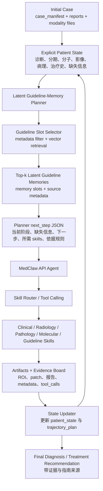
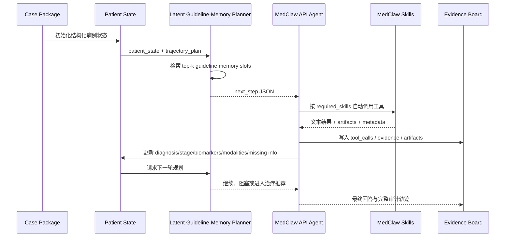

# Latent Guideline-Memory Planner 与 MedClaw API Agent 双 Agent 自动交互架构

本文档描述一个双 Agent 闭环架构，用于把“指南路径规划”和“多模态证据获取”解耦：`Latent Guideline-Memory Planner` 负责指南知识压缩、slot bank 自动选择、指南路径理解和下一步规划；`MedClaw API Agent` 负责按照 planner 输出调用工具、读取证据、更新显式 patient state，并形成可审计诊疗轨迹。

## 设计目标

双 Agent 架构的核心目标不是让一个大模型一次性完成所有工作，而是把诊疗推理拆成两个互补层次：

- `Latent Guideline-Memory Planner`：面向指南和路径。它不直接调用 CT、WSI、分子、临床工具，而是根据当前 patient state 与已有 trajectory plan，检索相关指南 latent memory，输出下一步诊疗路径规划。
- `MedClaw API Agent`：面向病例证据。它根据 planner 的建议调用 MedClaw skills，读取临床、影像、病理、分子和指南证据，解析工具产物，更新 patient state，并决定是否需要请求下一轮 planner。

这样可以把“是否按指南规划”与“是否正确使用多模态工具”分开评测，也能让不同核心多模态大模型在同一 planner 建议下展现不同证据整合能力。

## 总体架构



双 Agent 之间通过结构化状态和规划 JSON 交互，不共享隐式上下文。Planner 不读取原始图片、不执行工具；MedClaw API Agent 不直接访问 planner 的训练 rubric，只消费 planner 的下一步建议。

## Agent 1：Latent Guideline-Memory Planner

Planner 是一个独立于 `medclaw/` 的上层规划器，当前对应 `guideline_planner/` 包。它的职责是把指南文本转成可检索、可复用的 latent memory，并在病例推进时输出下一步路径规划。

### 训练与知识形态

Planner 的知识来源是 guideline markdown。训练前先按一级标题 `# ...` 切分 clinical-topic chunks，每个 chunk 保存：

```text
guideline_id
version
cancer_type
chapter
section
h1_title
source_rule_ids
source_span_ids
page_start / page_end
text
```

训练数据包含四类任务：

```text
[AE]        guideline section -> structured guideline reconstruction
[RETRIEVE] query -> positive / negative guideline slots
[CONTINUE] section -> next clinical phase / next pathway
[PLAN]     guideline section + patient_state + command -> planner output JSON
```

训练完成后，每个 guideline section 会导出：

```text
latent memory slots: .pt
retrieval embedding: .npy
slot metadata: slot_metadata.jsonl
```

这些文件组成本地 slot bank。后续运行时优先使用本地 memory store，不需要重复对指南生成 embedding。

### Planner 运行时输入

Planner 不接收完整病例原始文件，只接收显式 patient state 和 trajectory plan：

```json
{
  "case_id": "TCGA-38-4626",
  "cancer_type": "nsclc",
  "current_phase": "diagnostic_workup",
  "known_diagnosis": "lung adenocarcinoma",
  "known_stage": null,
  "known_biomarkers": {
    "EGFR": null,
    "ALK": null,
    "KRAS": null,
    "PD-L1": null
  },
  "available_modalities": {
    "clinical": true,
    "radiology": true,
    "pathology": true,
    "molecular": true,
    "guideline": true
  },
  "evidence_summary": [],
  "missing_information": []
}
```

`trajectory_plan` 是此前 planner 建议和 MedClaw 实际执行结果的摘要，例如已调用哪些 skills、哪些证据已确认、哪些路径被阻塞。

### Planner 输出协议

Planner 通过 `planner.next_step(patient_state, trajectory_plan)` 输出 JSON：

```json
{
  "current_phase": "diagnostic_workup",
  "missing_information": [
    "病理诊断",
    "TNM/临床分期",
    "驱动基因/PD-L1 等分子结果"
  ],
  "next_step": "补齐诊断、分期和分子分型证据后再进入治疗路径。",
  "required_skills": [
    "pathology.read_report",
    "pathology.conch_patch_roi",
    "radiology.lung_tumor_roi",
    "molecular.query_biomarkers",
    "guideline.retrieve"
  ],
  "guideline_memory_id": "2025_CSCO_NSCLC_Guideline::h1::0004",
  "supporting_rule_ids": [
    "2025_CSCO_NSCLC_Guideline::rule::diagnosis::001"
  ],
  "blocked_pathways": [
    "不能在缺少分期和分子结果时直接给出完整一线治疗方案"
  ],
  "reason": "当前病例仍缺少完整病理、影像分期和分子检测证据，应先完成诊断与分期闭环。"
}
```

Planner 只输出规划，不直接执行任何 skill。它的输出应当被视为“下一步诊疗路径建议”，不是最终诊断或治疗结论。

## Agent 2：MedClaw API Agent

MedClaw API Agent 是实际与病例和工具交互的 agent。它可以使用不同 provider 的核心多模态模型，例如 Qwen/OpenAI/Gemini/Claude/DeepSeek 等，负责把 planner 输出转化为工具调用和证据整合。

### 主要职责

MedClaw API Agent 负责：

- 读取病例 manifest、临床摘要、报告和可用模态列表。
- 按 planner 的 `required_skills` 调用对应 MedClaw skills。
- 对影像 ROI、病理 patch/full-slide overview 等图像 artifacts 做视觉理解。
- 从工具结果中抽取结构化证据，更新 patient state。
- 维护 evidence board、tool_calls、conversation log 和 trajectory。
- 判断当前 planner 建议是否已满足，必要时再次请求 planner。
- 在证据足够时输出最终诊断、分期、治疗推荐和指南依据。

### MedClaw 执行层

MedClaw API Agent 不直接操作原始文件，而是通过 skill router 调用工具。典型工具包括：

```text
clinical.read_summary
pathology.read_report
pathology.read_wsi_manifest
pathology.conch_patch_roi
radiology.read_ct_manifest
radiology.lung_tumor_roi
molecular.query_biomarkers
guideline.retrieve
```

每次工具调用都会产生可审计记录：

```text
tool_calls.jsonl
evidence_board.json
conversation.jsonl
trajectory.jsonl
artifacts/
```

对外部多模态模型，系统只发送必要的低维证据，例如 ROI PNG、patch contact sheet、全片低分辨率 overview 和文本摘要；不发送完整 NIfTI、WSI、JSON metadata 原文或大体积原始数据。

## 自动交互闭环

双 Agent 推荐采用“Planner 提议，MedClaw 执行，状态回写，再规划”的循环。



### 推荐循环伪代码

```python
patient_state = initialize_patient_state(case_manifest)
trajectory_plan = []

for round_id in range(max_rounds):
    planner_output = planner.next_step(patient_state, trajectory_plan)
    trajectory_plan.append({"planner": planner_output})

    if should_finalize(planner_output, patient_state):
        break

    execution_result = medclaw_agent.execute_plan(
        case_id=patient_state["case_id"],
        planner_output=planner_output,
        patient_state=patient_state,
    )

    evidence_board.add(execution_result)
    patient_state = update_patient_state(patient_state, execution_result)
    trajectory_plan.append({"execution": execution_result.summary})

final_answer = medclaw_agent.finalize(
    patient_state=patient_state,
    trajectory_plan=trajectory_plan,
    evidence_board=evidence_board,
)
```

## Patient State 更新规则

`patient_state` 是双 Agent 的共享显式状态，应保持小而稳定，不直接塞入大段报告或图片。推荐字段如下：

```json
{
  "case_id": "string",
  "cancer_type": "string | null",
  "current_phase": "diagnostic_workup | staging | molecular_workup | treatment_planning | followup",
  "known_diagnosis": "string | null",
  "known_stage": "string | null",
  "known_biomarkers": {
    "EGFR": "positive | negative | unknown | null",
    "ALK": "positive | negative | unknown | null",
    "KRAS": "positive | negative | unknown | null",
    "PD-L1": "string | null"
  },
  "radiology_summary": "string | null",
  "pathology_summary": "string | null",
  "molecular_summary": "string | null",
  "guideline_summary": "string | null",
  "available_modalities": {},
  "completed_skills": [],
  "missing_information": [],
  "blocked_pathways": [],
  "evidence_refs": []
}
```

MedClaw API Agent 每完成一个 tool call，就根据工具输出更新：

```text
diagnosis
stage
biomarkers
tumor location / imaging findings
pathology subtype / tumor content / IHC
guideline citations
missing information
blocked pathways
evidence_refs
```

`evidence_refs` 只保存可审计引用，例如 artifact path、tool call id、report section id、guideline page/source span id。

## 决策边界

双 Agent 的边界需要明确：

- Planner 可以说“下一步应补充分子检测”，但不能编造 EGFR/ALK 结果。
- Planner 可以说“当前缺少分期，不能直接进入完整治疗方案”，但不能替代影像/病理工具做诊断。
- MedClaw API Agent 可以调用 CT/WSI/分子/指南工具并解释证据，但不能跳过证据直接声称已查看模态。
- 最终治疗推荐必须引用 evidence board 中真实存在的证据和 guideline source metadata。

## 审计与评测

双 Agent 架构天然适合 benchmark，因为每一层都有可审计产物。

Planner 侧可评测：

```text
是否选择正确 cancer_type / guideline slots
是否识别当前 clinical phase
是否提出合理 missing_information
是否阻断证据不足的治疗路径
是否输出可执行 required_skills
是否引用正确 supporting_rule_ids
```

MedClaw API Agent 侧可评测：

```text
是否按 planner 建议调用工具
是否正确读取 ROI / patch / report / molecular evidence
是否更新 patient_state
是否在工具失败时诚实报告不确定性
是否最终给出有证据和指南页码/来源的诊疗建议
```

联合轨迹可评测：

```text
planner_output.jsonl
tool_calls.jsonl
evidence_board.json
patient_state_history.jsonl
conversation.jsonl
trajectory.jsonl
final_answers.json
judge_scores.json
```

其中，rubric 和 judge prompt 只进入评测器，不进入 Planner 或 MedClaw API Agent 的可见上下文。

## 典型运行阶段

建议把自动交互拆成以下阶段：

```text
1. Case initialization
   从 case_manifest 和 reports 初始化 patient_state。

2. Guideline planning
   Planner 检索 latent guideline memory，输出 next_step JSON。

3. Skill execution
   MedClaw API Agent 根据 required_skills 调用工具。

4. Evidence interpretation
   Agent 阅读工具文本与图像 artifacts，提取病例证据。

5. State update
   Agent 更新 patient_state，并记录缺失证据和阻塞路径。

6. Re-planning
   如果仍有关键缺失信息，回到 Planner；否则进入最终回答。

7. Final answer
   Agent 输出诊断、分期、治疗建议、指南依据、证据引用和不确定性。
```

## 与现有 MedClaw Benchmark 的关系

现有 MedClaw benchmark 已经让核心多模态模型通过 `tool_choice=auto` 自主调用 tools。双 Agent 架构是在它上面增加一个显式规划层：

```text
旧流程：
Case -> MedClaw API Agent -> Tools -> Final Answer

新流程：
Case -> Patient State -> Planner -> MedClaw API Agent -> Tools -> Patient State -> Planner -> Final Answer
```

新流程不会削弱核心多模态模型的评测价值。Planner 只给出“应该补什么证据、下一步路径是什么”，具体是否正确调用工具、是否能看懂 ROI/patch、是否能把证据整合成治疗推荐，仍然由 MedClaw API Agent 完成。

## 最小集成接口

第一版工程实现可以只加一个很薄的 orchestrator：

```python
class DualAgentOrchestrator:
    def __init__(self, planner, medclaw_agent, state_store, evidence_board):
        self.planner = planner
        self.medclaw_agent = medclaw_agent
        self.state_store = state_store
        self.evidence_board = evidence_board

    def run_case(self, case_id: str) -> dict:
        patient_state = self.state_store.initialize(case_id)
        trajectory_plan = []

        for _ in range(self.max_rounds):
            plan = self.planner.next_step(patient_state, trajectory_plan)
            trajectory_plan.append({"planner_output": plan})

            if self._ready_to_finalize(plan, patient_state):
                break

            result = self.medclaw_agent.execute_plan(plan, patient_state)
            self.evidence_board.add_result(result)
            patient_state = self.state_store.update(patient_state, result)
            trajectory_plan.append({"agent_execution": result.summary})

        return self.medclaw_agent.finalize(patient_state, trajectory_plan)
```

这个 orchestrator 不需要把 Planner 注册成 MedClaw skill。Planner 是上层 controller；MedClaw skills 仍由 MedClaw API Agent 执行。

## 后续扩展

后续可以逐步增强：

- 增加 `patient_state_history.jsonl`，记录每轮状态差异。
- 增加 planner confidence / uncertainty，用于决定是否需要人工复核。
- 让 MedClaw API Agent 对 planner 输出做可执行性检查，例如 skill 是否存在、模态是否可用、case manifest 是否包含文件。
- 给 planner output 增加 `priority` 和 `stop_condition`，避免工具调用过多。
- 将 guideline citation 细化到 `guideline_id + page + source_span_id + rule_id`。
- 在 benchmark judge 中分别评分 planner quality、agent evidence use 和 final recommendation quality。
